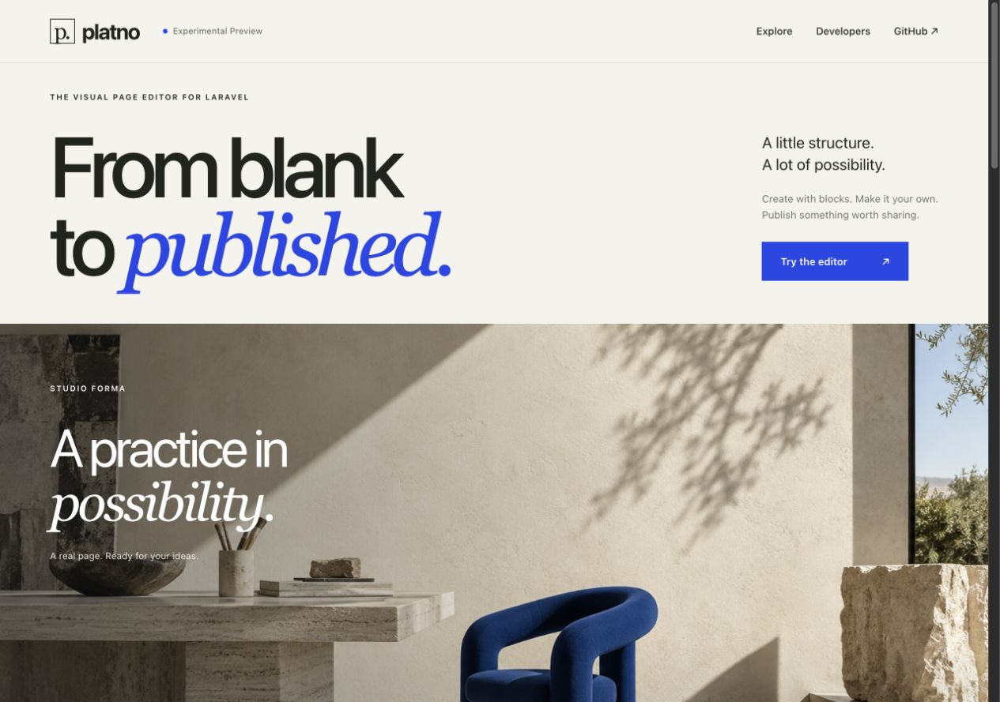

# Platno demo · Experimental Preview

> [!WARNING]
> **Pre-alpha prototype. Not ready for production.**
>
> This is a temporary playground for an experimental package. APIs, plugin contracts and saved-content formats may change without backward compatibility.
>
> **By default, every demo workspace expires 24 hours after creation, including its published pages and uploads.** Use disposable content only.

[](https://github.com/gogoSpace/platno-demo/actions/workflows/checks.yml)

A temporary playground for [Platno](https://github.com/gogoSpace/laravel-platno), the open-source visual page editor for Laravel. Choose a designed page, edit real content blocks, upload an image, and publish a read-only page. This application is a working package consumer and an integration example.



## Run locally

You need PHP 8.4, Composer 2, and the standard Laravel PHP extensions, including PDO SQLite, SQLite3, Fileinfo, and GD. The web process must be able to write to `storage/` and `bootstrap/cache/`.

The demo currently uses a Composer path repository at `../platno`. Clone the package and demo as sibling directories:

```sh
git clone https://github.com/gogoSpace/laravel-platno.git platno
git clone https://github.com/gogoSpace/platno-demo.git platno-demo
cd platno-demo
composer install
cp .env.example .env
php artisan key:generate
php artisan demo:prepare
php artisan serve --host=127.0.0.1 --port=8057
```

Open [localhost:8057](http://127.0.0.1:8057). `demo:prepare` creates the private registry database and applies the host application's registry migrations. Each visitor's content database is created when they start a demo; no manual database setup or seeding is needed.

The default editor requires **no Node, npm, Vite, or frontend build**. JavaScript and CSS are served directly. Livewire is installed through Composer. The optional Vue and React demonstrations load pinned framework modules from external CDNs when selected, so those modes need network access.

The package dependency tracks `dev-main` and is linked from the sibling checkout. Changes in that checkout immediately affect this demo. Keep the two repositories together when developing or deploying.

## Try the editor

1. Choose **The studio**, **The story**, or **The object**. A private workspace starts with a real draft and its own managed image.
2. Select a block to edit its fields. Core text and heading blocks also support editing on the canvas.
3. Use **Save draft**, then **Publish saved draft**. The share link displays the published snapshot; later draft edits stay private until you publish again.
4. Switch between Native, Vue, React, and Livewire to see different hosts for the same editor and page.

Your browser's ownership cookie grants editing access. A copied editor address does not grant ownership, and a public share link grants read-only access. **Start over** asks for confirmation, revokes the previous workspace, and creates a fresh copy.

## Temporary workspaces

Each workspace has a separate SQLite database and private media directory. Owner routes select the workspace before any editor request, including canvas rendering, uploads, publication history, and Livewire updates. Public routes select a read-only context and serve published pages and their eligible media.

The default lifetime is **24 hours from creation**. Visits, saves, publication, and shared-page reads do not extend that deadline. Expiration revokes access immediately on the next request, independently of physical cleanup. Closing the browser does not pause it.

Default limits are defined in [config/demo.php](config/demo.php) and [config/platno.php](config/platno.php):

| Limit | Default |
| --- | --- |
| Workspace lifetime | 24 hours |
| Pages per workspace | 3 |
| Managed files per workspace | 20, including the template image |
| Total managed file size | 15 MiB per workspace |
| Individual upload | 5 MiB |
| Publication snapshots | 30 per workspace |
| Submitted document size | 200 KiB |
| Registered workspaces | 200 per installation |

New workspace requests are also rate limited. Expired workspaces occupy registry capacity until cleanup removes them.

For local cleanup, keep Laravel's scheduler running in a second terminal:

```sh
php artisan schedule:work
```

The scheduled `demo:cleanup --limit=100` runs every five minutes. It removes expired content and uploads, skips workspaces locked by an active request, and leaves active visitors alone. You can also invoke `php artisan demo:cleanup --limit=100` manually when you want to remove expired demo data.

## Package features and demo features

| Responsibility | Owner |
| --- | --- |
| Structured documents, plugin schemas, validation, editor, draft revisions, publication snapshots, and managed assets | Platno package |
| Visitor cookies, workspace routing, separate databases and private disks, expiration, quotas, and cleanup | This demo application |
| Gallery, templates, imagery, typography, and the `demo.hero` / `demo.quote` example blocks | This demo application |
| Authentication and authorization in a real application | The consuming application |

The anonymous demo ownership mechanism is purpose-built for temporary workspaces. Installing Platno in your own application does not install that mechanism, enforce these quotas, or expire your pages.

## Customize the example

- [app/Plugins/Hero.php](app/Plugins/Hero.php) and [app/Plugins/Quote.php](app/Plugins/Quote.php) define example plugin fields. Their escaped Blade templates are in [resources/views/plugins](resources/views/plugins).
- [app/Demo](app/Demo) contains the three structured page templates and workspace services. [DemoContent](app/Services/DemoContent.php) imports the selected local image through the package asset API and creates a draft.
- [config/platno.php](config/platno.php) registers the plugins and theme tokens. [public/styles/content.css](public/styles/content.css) adds demo styling to the core blocks.
- [resources/views/vendor/platno/public](resources/views/vendor/platno/public) customizes the public shell. Its shared style include is also used by the editor canvas, so both render the same content and styles.
- [public/adapters](public/adapters) and [app/Livewire](app/Livewire) demonstrate optional framework hosts. The editor itself stays in the package.

For the plugin contract and supported extension points, start with the package's [plugin guide](https://github.com/gogoSpace/laravel-platno/blob/main/docs/plugins.md). The photographs are original generated demo assets; see [image provenance](docs/assets.md).

## Checks

```sh
composer check
```

This validates Composer metadata, checks PHP formatting, and runs the focused feature suite. The tests use fresh, guarded temporary directories and databases; they do not reuse local visitor workspaces. See [CONTRIBUTING.md](CONTRIBUTING.md) for JavaScript syntax checks and the review workflow.

GitHub Actions checks the demo with PHP 8.4 and a sibling checkout of the package. A workflow result verifies that run's code and dependencies; it is not a deployment health check.

## Hosting

The [ops](ops) directory contains example Apache virtual hosts and a dedicated PHP-FPM pool. Adapt the domain, certificates, paths, process user, and limits to your environment. Serve only `public/`, keep the registry and workspace files outside the document root, and persist private storage across releases.

Use PHP 8.4, HTTPS, a private application key, `APP_ENV=production`, `APP_DEBUG=false`, and `SESSION_SECURE_COOKIE=true`. Configure Laravel's scheduler to run every minute so the five-minute cleanup schedule is executed. All processes that serve or clean up the demo need consistent access to its private files and file locks. The current workspace context is designed for the ordinary PHP-FPM request lifecycle on one host; long-running application servers and distributed storage need separate integration work.

## Contributing and security

Read [CONTRIBUTING.md](CONTRIBUTING.md) before proposing a change. Report vulnerabilities privately using [SECURITY.md](SECURITY.md).

## License

MIT. See [LICENSE](LICENSE).
